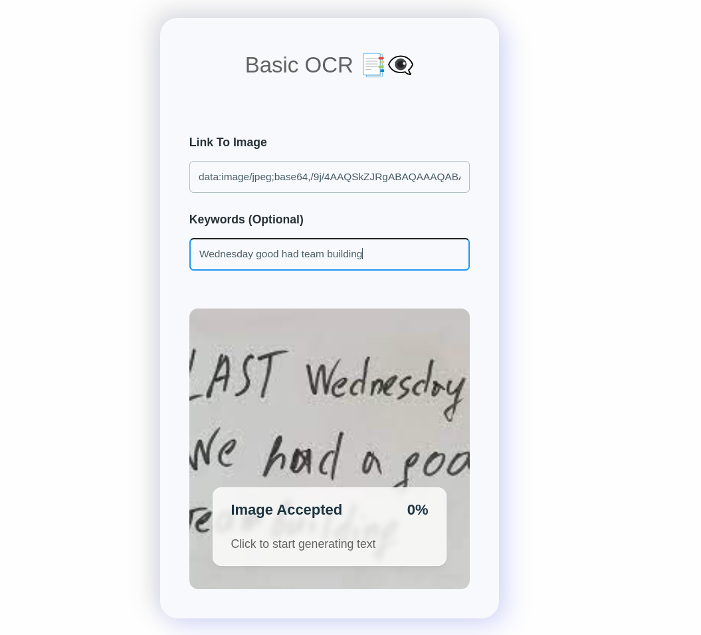

# Tesseract OCR Project

## Client Setup

To set up the client, run the following commands:

```sh
cd client
npm install
npm start
```

## Server Setup

To set up the server, run the following commands:

```sh
cd server
npm install
npm start
```

Here's a preview of the project:

